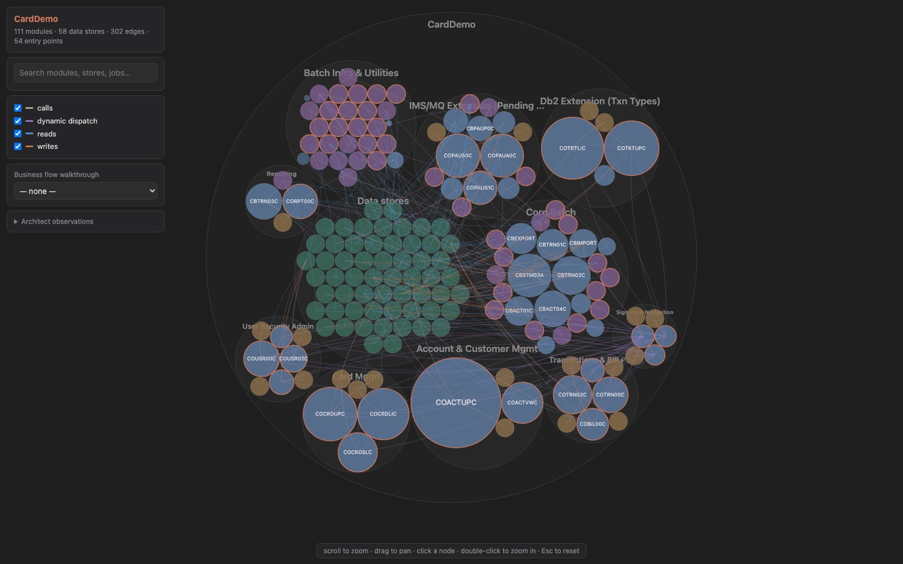

# Code Modernization Plugin

A structured workflow and set of specialist agents for modernizing legacy codebases — COBOL, legacy Java/C++, monolith web apps — into current stacks while preserving behavior.

## Overview

Legacy modernization fails most often not because the target technology is wrong, but because teams skip steps: they transform code before understanding it, reimagine architecture before extracting business rules, or ship without a harness that would catch behavior drift. This plugin enforces a sequence:

```
preflight → assess → map → extract-rules → brief → reimagine | transform → harden
```

The discovery commands (`assess`, `map`, `extract-rules`) build artifacts under `analysis/<system>/`. The `brief` command synthesizes them into an approval gate. The build commands (`reimagine`, `transform`) write new code under `modernized/`. The `harden` command audits the legacy system and produces a reviewable remediation patch. Each step has a dedicated slash command, and specialist agents (legacy analyst, business rules extractor, architecture critic, security auditor, test engineer) are invoked from within those commands — or directly — to keep the work honest.

## Expected layout

Commands take a `<system-dir>` argument and assume the system being modernized lives at `legacy/<system-dir>/`. Discovery artifacts go to `analysis/<system-dir>/`, transformed code to `modernized/<system-dir>/…`. If your codebase lives elsewhere, symlink it in:

```bash
mkdir -p legacy && ln -s /path/to/your/legacy/codebase legacy/billing
```

## What to give Claude

The commands degrade gracefully, but each of these makes the output meaningfully better — run `/modernize-preflight <system-dir>` to check all of them at once and get a readiness report:

- **Analysis tools**: [`scc`](https://github.com/boyter/scc) (LOC + complexity + COCOMO) or [`cloc`](https://github.com/AlDanial/cloc); [`lizard`](https://github.com/terryyin/lizard) for portfolio mode. Without them, metrics fall back to `find`/`wc` and get coarser.
- **A working build toolchain** for the legacy stack (e.g. GnuCOBOL for COBOL) — required before `/modernize-transform` can prove behavioral equivalence, and verified by preflight with a real smoke compile against your code.
- **The whole system in the tree**: deployment descriptors (JCL, CICS definitions, route configs), copybooks/includes, and DDL/schemas. Entry-point detection and data lineage in `/modernize-map` are guesswork without them.
- **Production telemetry** (optional): an observability MCP server or batch job logs enable the runtime overlay in `/modernize-assess` and timing annotations on critical paths.

## Secret handling

Legacy systems routinely contain live credentials, and assessment artifacts get committed and shared. **Every agent in this plugin masks credential values** — findings, rule-card parameters, architecture notes, and test fixtures cite `file:line` with a masked preview (`AKIA****`), never the value. When credentials are found, a per-credential inventory (type, location, blast radius, rotation recommendation) is written to `analysis/<system>/SECRETS.local.md`, which the commands gitignore before writing; on non-git projects the quarantine file goes to `~/.modernize/<system>/` instead. `/modernize-harden` splits its remediation diff so credential-removal hunks (which necessarily contain the raw value) land in a gitignored `security_remediation.local.patch`, never the shareable patch. Pass `--show-secrets` to include raw values in the quarantine file (and only there). If you ran an earlier version of this plugin on a real system, check whether `analysis/` artifacts containing credentials were committed or shared, and rotate anything that was.

## Commands

The commands are designed to be run in order, but each produces a standalone artifact so you can stop, review, and resume.

### `/modernize-preflight <system-dir> [target-stack]`
Environment readiness check, meant to run first: detects the legacy stack, checks analysis tooling, **smoke-compiles a real source file** with the legacy toolchain (the errors this surfaces — missing copybooks, wrong dialect flags — are the ones that otherwise appear mid-transform), inventories missing includes / deployment descriptors / binary-only artifacts, and probes for telemetry. Produces `analysis/<system>/PREFLIGHT.md` with a per-command Ready / Ready-with-gaps / Not-ready verdict.

### `/modernize-assess <system-dir>`  — or — `/modernize-assess --portfolio <parent-dir>`
Inventory the legacy codebase: languages, line counts, complexity, build system, integrations, technical debt, security posture, documentation gaps, and a COCOMO-derived effort estimate. Produces `analysis/<system>/ASSESSMENT.md` and `analysis/<system>/ARCHITECTURE.mmd`. Spawns `legacy-analyst` (×2) and `security-auditor` in parallel for deep reads. With `--portfolio`, sweeps every subdirectory of a parent directory and writes a sequencing heat-map to `analysis/portfolio.html`.

### `/modernize-map <system-dir>`



Build a dependency and topology map of the **legacy** system: program/module call graph, data lineage (programs ↔ data stores), entry points, dead-end candidates, and 2–4 traced business flows each anchored to a persona (the claimant, the operator, the auditor — not the maintainer). Writes a re-runnable extraction script and produces `analysis/<system>/topology.json` plus `analysis/<system>/TOPOLOGY.html` — an **interactive zoomable map** (circle-pack of domains/modules sized by LOC, dependency edges with per-kind toggles, search, click-for-details sidebar, and a walkthrough mode that plays each persona flow as a numbered path with a plain-language narrative). Built from a template shipped with the plugin, so it works on systems far too dense for a static diagram. Small domain-level `call-graph.mmd`, `data-lineage.mmd`, and `critical-path.mmd` are still exported for docs and PRs.

### `/modernize-extract-rules <system-dir> [module-pattern]`
Mine the business rules embedded in the legacy code — calculations, validations, eligibility, state transitions, policies — into Given/When/Then "Rule Cards" with `file:line` citations and confidence ratings. Spawns three `business-rules-extractor` agents in parallel (calculations, validations, lifecycle). Produces `analysis/<system>/BUSINESS_RULES.md` and `analysis/<system>/DATA_OBJECTS.md`.

### `/modernize-brief <system-dir> [target-stack]`
Synthesize the discovery artifacts into a phased **Modernization Brief** — the single document a steering committee approves and engineering executes: target architecture, strangler-fig phase plan with entry/exit criteria, persona-based business walkthroughs (the section non-technical approvers actually read), behavior contract, validation strategy, open questions, and an approval block. Reads `ASSESSMENT.md`, `TOPOLOGY.html`, and `BUSINESS_RULES.md` and **stops if any are missing** — run the discovery commands first. Produces `analysis/<system>/MODERNIZATION_BRIEF.md` and enters plan mode as a human-in-the-loop gate.

### `/modernize-reimagine <system-dir> <target-vision>`
Greenfield rebuild from extracted intent rather than a structural port. Mines a spec (`analysis/<system>/AI_NATIVE_SPEC.md`), designs a target architecture and has it adversarially reviewed (`analysis/<system>/REIMAGINED_ARCHITECTURE.md`), then **scaffolds services with executable acceptance tests** under `modernized/<system>-reimagined/` and writes a `CLAUDE.md` knowledge handoff for the new system. Two human-in-the-loop checkpoints. Spawns `business-rules-extractor`, `legacy-analyst` (×2), `architecture-critic`, and general-purpose scaffolding agents.

### `/modernize-transform <system-dir> <module> <target-stack>`
Surgical, single-module strangler-fig rewrite. Plans first (HITL gate), then writes characterization tests via `test-engineer`, then an idiomatic target implementation under `modernized/<system>/<module>/`, proves equivalence by running the tests, and produces `TRANSFORMATION_NOTES.md` mapping legacy → modern with deliberate deviations called out. Reviewed by `architecture-critic`.

### `/modernize-status <system-dir>`
Read-only progress report: artifact inventory with timestamps per workflow stage, staleness flags (e.g. a brief older than the assessment it was built from), secrets-hygiene checks (quarantine file gitignored and never committed), and the single most useful next command. Run it anytime you come back to a modernization after a break.

### `/modernize-harden <system-dir>`
Security hardening pass on the **legacy** system: OWASP/CWE scan, dependency CVEs, secrets, injection. Spawns `security-auditor`. Produces `analysis/<system>/SECURITY_FINDINGS.md` ranked Critical / High / Medium / Low and a reviewed `analysis/<system>/security_remediation.patch` with minimal fixes for the Critical/High findings. The patch is reviewed by a second `security-auditor` pass before you see it. **Never edits `legacy/`** — you review and apply the patch yourself when ready, then re-run to verify. Useful as a pre-modernization step when the legacy system will keep running in production during the migration.

## Agents

- **`legacy-analyst`** — Reads legacy code (COBOL, legacy Java/C++, procedural PHP, classic ASP) and produces structured summaries. Good at spotting implicit dependencies, copybook inheritance, and "JOBOL" patterns (procedural code wearing a modern syntax). Used by `assess` and `reimagine`.
- **`business-rules-extractor`** — Extracts business rules from procedural code with source citations. Each rule includes: what, where it's implemented, which conditions fire it, and any corner cases hidden in data. Used by `extract-rules` and `reimagine`.
- **`architecture-critic`** — Adversarial reviewer for target architectures and transformed code. Default stance is skeptical: asks "do we actually need this?" Flags microservices-for-the-resume, ceremonial error handling, abstractions with one implementation. Used by `reimagine` and `transform`.
- **`security-auditor`** — Reviews code for auth, input validation, secret handling, and dependency CVEs. Tuned for the kinds of issues that appear when translating security primitives across stacks (e.g., session handling from servlet to stateless JWT). Used by `assess` and `harden`.
- **`test-engineer`** — Writes characterization, contract, and equivalence tests that pin legacy behavior so transformation can be proven correct. Flags tests that exercise code paths without asserting outcomes. Used by `transform`.

## Installation

```
/plugin install code-modernization@claude-plugins-official
```

## Recommended Workspace Setup

This plugin ships commands and agents, but modernization projects benefit from a workspace permission layout that enforces the "never touch legacy, freely edit modernized" rule. A starting-point `.claude/settings.json` for the project directory you're modernizing:

```json
{
  "permissions": {
    "allow": [
      "Bash(git diff:*)",
      "Bash(git log:*)",
      "Bash(git status:*)",
      "Read(**)",
      "Write(analysis/**)",
      "Write(modernized/**)",
      "Edit(analysis/**)",
      "Edit(modernized/**)"
    ],
    "deny": [
      "Edit(legacy/**)",
      "Write(legacy/**)"
    ]
  }
}
```

Adjust `legacy/` and `modernized/` to match your actual layout. The key invariants: `Edit`/`Write` under `legacy/` are denied, and writes are scoped to `analysis/` (for documents) and `modernized/` (for the new code). Note this guards the file tools — shell commands that mutate files (`sed -i`, `git apply`) still go through the normal Bash permission prompt, so review those prompts with the same invariant in mind. Every command in this plugin respects this — `/modernize-harden` writes a patch to `analysis/` rather than editing `legacy/` in place.

## Typical Workflow

```bash
# 0. Check the environment is ready (tools, toolchain, source completeness)
/modernize-preflight billing

# 1. Inventory the legacy system (or sweep a portfolio of them)
/modernize-assess billing

# 2. Map call graph, data lineage, and the critical path
/modernize-map billing

# 3. Extract business rules into testable Rule Cards
/modernize-extract-rules billing

# 4. Synthesize the approved Modernization Brief (human-in-the-loop gate)
/modernize-brief billing java-spring

# 5a. Greenfield rebuild from the extracted spec…
/modernize-reimagine billing "event-driven services on Java 21 / Spring Boot"

# 5b. …or transform module by module (strangler fig)
/modernize-transform billing interest-calc java-spring

# 6. Security-harden the legacy system that's still in production
/modernize-harden billing

# Anytime: where am I, what's stale, what's next
/modernize-status billing
```

## License

Apache 2.0. See `LICENSE`.
